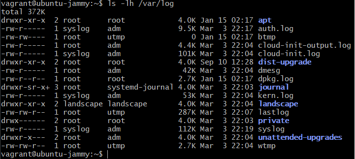
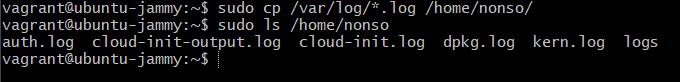

### To view the system logs with permissions and human readable file sizes  

`ls -lh /var/log`  

  

### To copy all .log files from /var/log to /home/nonso and view it  

`cp /var/log/*log /home/nonso`  
`ls /nonso/log`  

  

### Change file permissions to read-only for others on /home/nonso/log  

`sudo chmod 640 /home/nonso/logs`  

